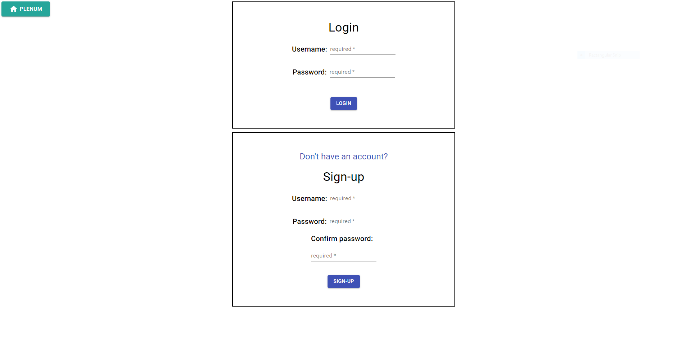
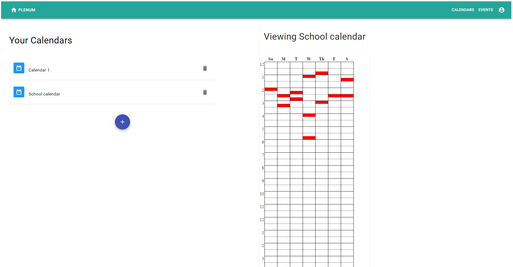
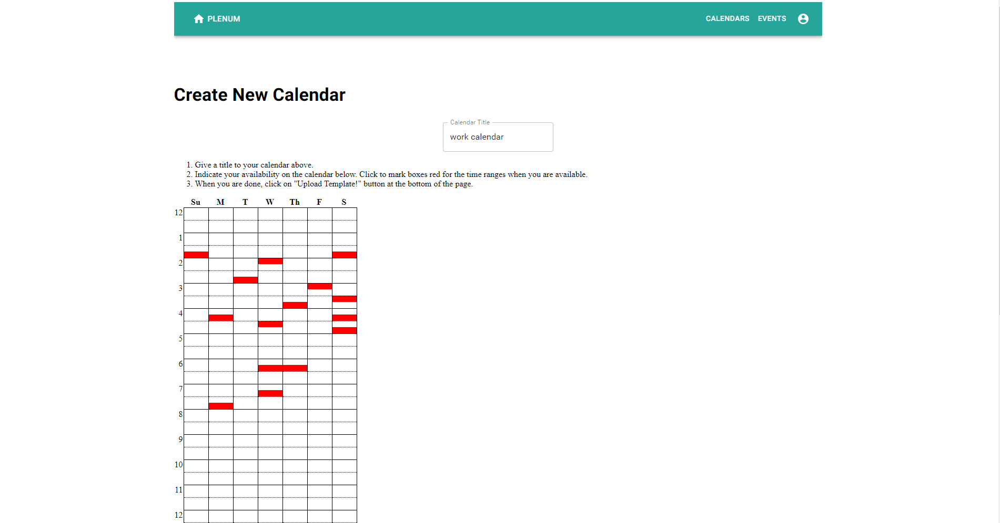
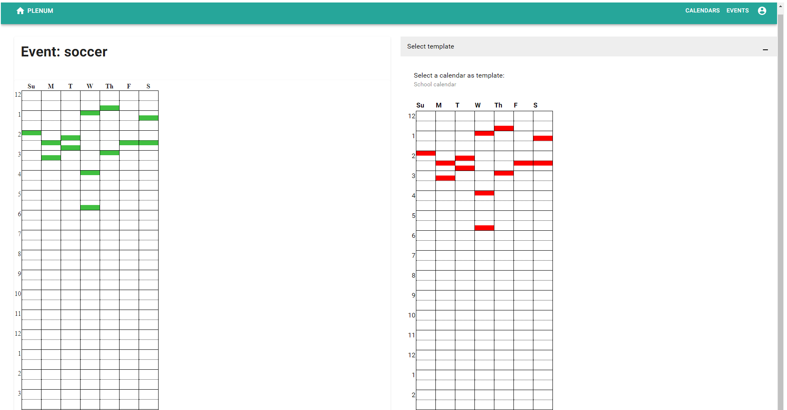
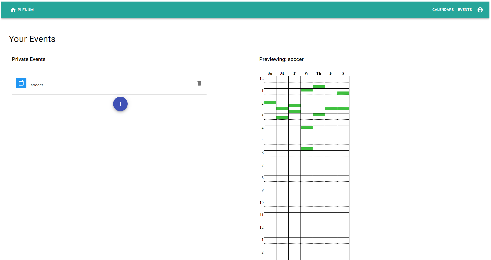
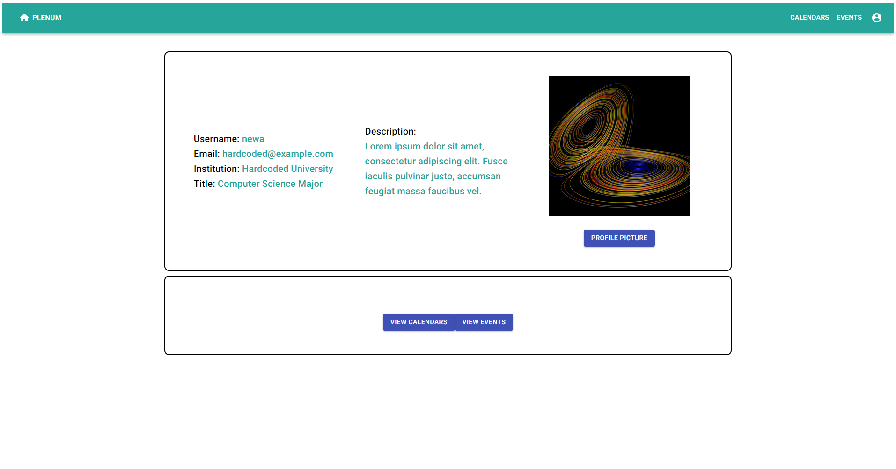
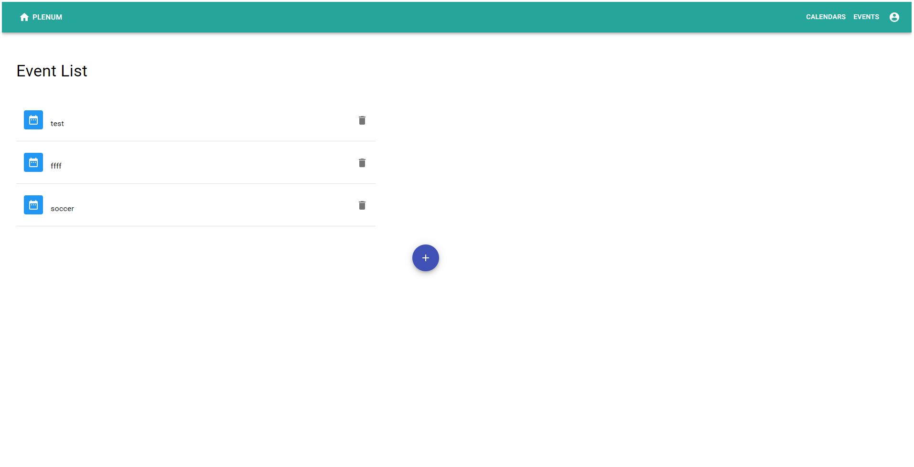

# Software Requirements Specifications

## Problem Statement 

> Write a few sentences that describes the problem you are trying to solve. In other words, justify why this software project is needed.

There currently exist multiple scheduling websites like When2Meet that, though useful
for seeing people’s availability and arranging meeting times based on max availability,
do not save previously entered availability. Users have to re-enter the same
availability every time they fill out a new When2Meet, which proves to be inconvenient
and inefficient.

## Potential Clients
> Who are affected by this problem (and would benefit from the proposed solution)? I.e. the potential users of the software you are going to build.

Any person or group of people who needs to keep track of their schedules and share it
with others in order to coordinate meeting times, especially those that want to save
their schedules and settings so that they save time not needing to input the same
settings over and over again.

## Proposed Solution
> Write a few sentences that describes how a software solution will solve the problem described above.

Create a web application that allows users to not only create a calendar and have
other users go to the link to fill out their availability on the calendar, but have
extra features that allow users to import an existing calendar elsewhere or save
their previous inputs. This would make the process of arranging meetings much more
efficient and less tedious.

## Functional Requirements
> List the (functional) requirements that software needs to have in order to solve the problem stated above. It is useful to write the requirements in form of **User Stories** and group them into those that are essential (must have), and those which are non-essential (but nice to have).

### Must have
* As someone who needs to share my availability with other people, I need this
application to include a way to have me enter, save, and submit my availability,
so that I can coordinate with others more efficiently.

* As someone who needs to be able to coordinate scheduling between multiple people,
I need this application to have a way to view aggregate availabilities, so that I
can coordinate events more efficiently.

* As someone who frequently has to schedule multiple distinct events with other people,
I need to be able to log in and log out of this application to securely store
information related to my availability.

* As someone who frequently has to schedule multiple distinct events with other people,
I need this application to include a way to save at least one calendar representing my
schedule, so that I can submit my availability more conveniently.

* As someone who frequently has to schedule multiple distinct events with other people,
I need this application to store many different calendars for me, so that I can submit
my availability differently for events that I have different amount of
commitments to. For example, for my job I may want to list more availability, but for
a school club, I may want to list less availability, and I would like both calendars
to be stored for quick use.

### Nice to have
* As someone who frequently uses my calendar to schedule events throughout my life,
I need to be able to import my schedule from my calendar application, so that I can
set my availabilities in an efficient and convenient way.

* As a college student who has to center my life around my classes, I would like to be
able to set my availability directly by importing the class schedule I have this
semester (through sis integration) so as to make my scheduling quick and easy to
carry out.

* As a student who works with people in other time zones, I would like to easily be
able to set and view my availability in any time zone of my choosing, so as to be able
to more easily communicate with people in different time zones.

* As a student who works with people in other time zones, I would like to easily view
my availability by reshaping the calendar so that each distinct day in my local time
zone is displayed on a different column.

* As a user that wants to avoid wasting time on deciding a meeting time once
the group's availability is known, I would like to be able to suggest meeting
times within the application itself, which are placed on a ranked list. Individuals
in the event can upvote/downvote suggested events to come to a consensus about which
meeting time is most optimal. 

* As a user that wants to avoid wasting time on deciding a meeting time once
the group's availability is known, I would like the application to suggest meeting
times autonomously for the group, based on the avaliability, so as to more easily
finalize a meeting time once avaliabilities are known.

* As someone who frequently has to schedule multiple distinct events with other people
on different days of the week, I would like to store calendars specifically for
certain days of the week, so as to allow me to plan my availability in different
chunks for different times of the week.

* As a user whose weekly availability may constantly change, such as having new shifts
assigned at work, or having new hours of access at some research lab, I would like a
feature to have my availiability for specific events automatically changed to reflect
my changing schedule. This may include the ability to use the same calendar to
indicate availability for multiple events, or some sort of syncing feature, which can
notify me of all 'derived' event calendars that may need to be updated after a change
to the 'base' calendar.

* As a user who is involved in many activities and would like to mark unavailability
for each commitment separately, I would like to store calendars specifically meant for
this purpose, and not for use to indicate availability for events directly. These
calendars could be called 'activity' calendars.

* As a user who is involved in many activities and would like to mark unavailability
for each commitment separately, I would like an easy calendar composition feature,
allowing me to easily create a new 'base' calendar by combining 'activity' calendars.

* As a user whose weekly availability may constantly change, I would like a feature
that allows me to automatically progogate or merge some changes from 'base' calendars
to other 'derived' calendars that I have used to indicate my availability for a
number of events, resolving merge conflicts through a special calendar view.

* As a user who has many one-off events that change availability different from week
to week, I would like some way to import these one-off events into this application,
so that it will automatically show up on 'derived' calendars showing my availability
for a specific week.

* As a user that organizes weekly meetings that may have to occur at different times
every week, I would like a way to view aggregate availabilities on a week-by-week
view, which is able to correctly aggregate one-off events of each person in the event. 

* As a user that schedules many events using this app, I would like a feature that
automatically creates a one-off event or 'activity' calendar once a meeting time for
an event is finalized using this app, so that I do not have to manually edit
availability for the numerous yet un-finalized events.

* As a user that has many calendars and events using this app, I would like to save
and edit the order of various stored items, so that I can have my most used or
important items on a consistant and easy part of the page to access.

* As a user that has many calendars and events using this app, I would like the
ability to star or pin key items, especially upcoming items, so that I can have my
most used or important items on a consistant and easy part of the page to access.

* As a user that has many calendars and events using this app, I would like to search
for various stored items, so that I can easily access the many items without spending
a lot of time manually searching for it.

* As a user that schedules many events using this app, I would like the app to remind
me of near upcoming events, so that I am less likely to forget about them.

## Software Architecture
> Will this be a Web/desktop/mobile (all, or some other kind of) application? Would it conform to the Client-Server software architecture? 

* This would be a client-server architecture. We may potentially use React for the
frontend and a simple framework like Sparkjava for the backend.

## User Stories
> List major user stories here

Please refer to the functional requirements above, which are written in user story
form. This matches the format we had for Homework 1, where functional requirements
and user stories were combined. https://piazza.com/class/kd13q8ukge2e1?cid=71_f1

## Wireframes

