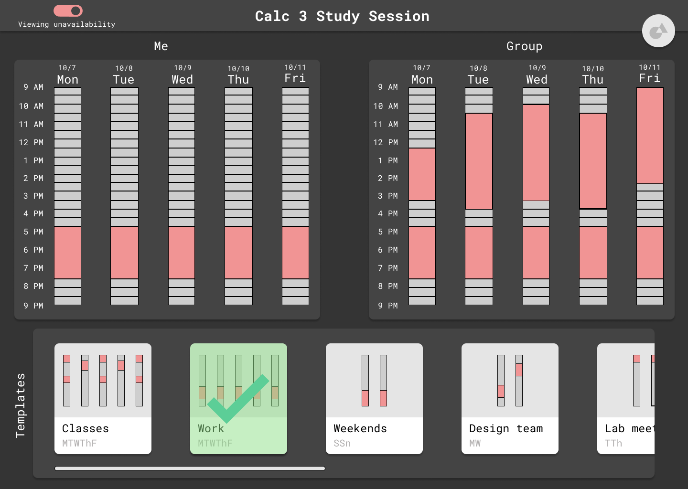

# Software Requirements Specificatins

## Problem Statement 

> Write a few sentences that describes the problem you are trying to solve. In other words, justify why this software project is needed.

There currently exist multiple scheduling websites like When2Meet that, though useful
for seeing people’s availability and arranging meeting times based on max availability,
do not save previously entered availability. Users have to re-enter the same
availability every time they fill out a new When2Meet, which proves to be inconvenient
and inefficient.

## Potential Clients
> Who are affected by this problem (and would benefit from the proposed solution)? I.e. the potential users of the software you are going to build.

Any person or group of people who needs to keep track of their schedules and share it
with others in order to coordinate meeting times, especially those that want to save
their schedules and settings so that they save time not needing to input the same
settings over and over again.

## Proposed Solution
> Write a few sentences that describes how a software solution will solve the problem described above.

Create a web application that allows users to not only create a calendar and have
other users go to the link to fill out their availability on the calendar, but have
extra features that allow users to import an existing calendar elsewhere or save
their previous inputs. This would make the process of arranging meetings much more
efficient and less tedious.

## Functional Requirements
> List the (functional) requirements that software needs to have in order to solve the problem stated above. It is useful to write the requirements in form of **User Stories** and group them into those that are essential (must have), and those which are non-essential (but nice to have).

### Must have
* As someone who needs to be able to coordinate scheduling between multiple people,
I need this application to include a way to have multiple people enter, save, and
submit their availabilities, and a way to view aggregate availabilities, so that I
can coordinate events more efficiently.

* As someone who frequently has to schedule multiple distinct events with other people,
I need this application to include a way to include a default availability schedule
so that I can submit my availability more conveniently.

* As someone who frequently uses my calendar to schedule events throughout my life,
I need to be able to import my schedule from my calendar application, so that I can
set my availabilities in an efficient and convenient way.

### Nice to have
* As a college student who has to center my life around my classes, I would like to be
able to set my availability directly by importing the class schedule I have this
semester (through sis integration) so as to make my scheduling quick and easy to
carry out.

* As a student who works with people in other time zones, I would like to easily be
able to set my availability in any time zone of my choosing, and view my availability
in any time zone of my choosing, so as to be able to more easily communicate with
people in different time zones.

## Software Architecture
> Will this be a Web/desktop/mobile (all, or some other kind of) application? Would it conform to the Client-Server software architecture? 

* This would be a client-server architecture. We may potentially use React for the
frontend and a simple framework like Javalin or Sparkjava for the backend.

## User Stories
List major user stories here

Please refer to the functional requirements above, which are written in user story
form. This matches the format we had for Homework 1, where functional requirements
and user stories were combined.

## Wireframes

